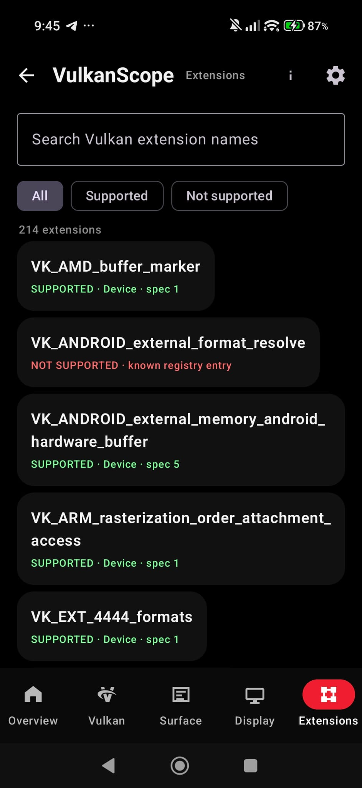

VulkanScope 0.15.5 is a feature-focused Vulkan inspection release for Android, with extensive device capability reporting, Surface/Display/HDR inspection, Vulkan Video and Profile evaluation, offline registry-driven coverage, and Turnip / third-party driver support.

## Highlights

- Vulkan **1.0 through 1.4** core capability inspection
- Detailed Vulkan device properties, limits and features
- Runtime instance and device extension enumeration
- Extension search and filtering
- Instance layer and device layer information
- Device-layer extension information
- Queue family and presentation capability inspection
- Detailed memory heap and memory type reporting
- Extensive Vulkan format capability inspection
- Vulkan Surface capabilities, formats, color spaces and present modes
- Android Display and HDR capability inspection
- HDR luminance and wide-color information
- Vulkan Profile evaluation
- Vulkan Video decode and encode capability inspection
- Vulkan Video queue and format capability reporting
- Offline Khronos Vulkan registry-driven query coverage
- Turnip / third-party Vulkan driver support
- TXT and HTML report export
- Multi-ABI Android native builds

---

## Screenshots

  
  
  

  
  
  

  

## Vulkan Core 1.0–1.4

VulkanScope reports the core Vulkan API capabilities exposed by the installed implementation, including:

- Vulkan API version
- Instance information
- Physical-device information
- Core Vulkan 1.0 features
- Vulkan 1.1 core feature structures
- Vulkan 1.2 core feature structures
- Vulkan 1.3 core feature structures
- Vulkan 1.4 core feature structures
- Core Vulkan properties
- GPU limits
- Device capabilities
- Pipeline-cache UUID
- Sparse residency information
- Subgroup-related properties
- Core 1.4 detailed properties

The application uses the runtime Vulkan implementation as the source of device capability information rather than assuming support from the API version alone.

---

## Extensions

VulkanScope provides runtime enumeration of Vulkan extensions with:

- Exact extension names
- Instance/device scope
- Extension `specVersion`
- Search
- Filtering
- Supported / unsupported / all views where applicable
- Dependency-aware instance-extension handling
- Vendor-specific extension coverage

The extension system covers Vulkan functionality from a broad range of Khronos and vendor ecosystems, including areas such as:

- Memory
- Synchronization
- Descriptor management
- Dynamic rendering
- Ray tracing
- Mesh shading
- Variable-rate shading
- Android extensions
- External memory
- External synchronization
- Surface and presentation
- Format support
- Debugging
- Vendor-specific functionality

---

## Layers

Layer information is available at both instance and device scope where exposed by the Vulkan implementation.

VulkanScope can report:

- Instance layers
- Device layers
- Layer names
- Layer-provided extension information
- Layer extension `specVersion`

Layer information reflects what the installed Vulkan loader/driver actually exposes on the device.

---

## Device Information

The Device section provides detailed physical-device information including:

- Device name
- Device type
- Vendor ID
- Device ID
- Driver version
- Vulkan API version
- Driver properties
- Device properties
- Physical-device limits
- Device capabilities
- Device-level extensions
- Pipeline cache UUID
- Sparse memory/residency capabilities
- Subgroup properties
- Core-version-specific properties

---

## Features

VulkanScope exposes device feature support reported by Vulkan.

Feature coverage includes areas such as:

- Robust buffer access
- Geometry and tessellation
- Wide lines
- Large points
- Multi-viewport rendering
- Sampler capabilities
- Texture compression
- Occlusion queries
- Pipeline statistics
- Shader functionality
- Sparse resources
- Multi-draw functionality
- Descriptor functionality
- Dynamic rendering
- Synchronization
- Advanced shader functionality
- Extension-specific feature structures
- Vendor-specific feature structures

Core 1.1, 1.2, 1.3 and 1.4 feature structures are included when exposed by the implementation.

---

## Surface

VulkanScope creates and queries a real Android `VkSurfaceKHR` and reports presentation-related capabilities.

Surface information includes:

- Surface capabilities
- Minimum image count
- Maximum image count
- Current extent
- Minimum image extent
- Maximum image extent
- Maximum image-array layers
- Supported transforms
- Current transform
- Supported composite-alpha modes
- Supported image usage flags
- Presentation modes
- Surface formats
- Surface color spaces
- Queue-family presentation support

Surface entries can be searched directly.

---

## Surface Formats & Color Spaces

VulkanScope displays the exact Vulkan format + color-space combinations reported by the implementation.

Examples include formats such as:

- `VK_FORMAT_B8G8R8A8_UNORM`
- `VK_FORMAT_R8G8B8A8_UNORM`
- `VK_FORMAT_A2B10G10R10_UNORM_PACK32`

Color-space information can include:

- sRGB
- BT.709
- BT.2020
- Display P3
- HDR10 / ST2084
- HLG
- Extended sRGB
- Other Vulkan-defined and extension-defined color spaces

This makes the Surface section useful for investigating SDR/HDR presentation, wide gamut and color-space compatibility.

---

## Display & HDR

The Display & HDR section separately reports Android display capabilities rather than treating Vulkan surface color spaces as a substitute for display information.

Depending on the device, this includes:

- HDR types
- HDR capability
- Minimum luminance
- Maximum luminance
- Average luminance
- Wide-color capability
- Preferred wide-gamut color space
- Display modes
- Display resolution
- Refresh-rate information
- Display-related presentation information

Vulkan Surface color-space information and Android physical-display gamut information are kept as separate data sources.

---

## Memory

VulkanScope reports the physical device memory configuration, including:

- Memory heap count
- Memory type count
- Heap sizes
- Heap flags
- Memory type flags
- Memory type → heap relationships
- Device-local memory
- Host-visible memory
- Host-coherent memory
- Host-cached memory
- Lazily allocated memory where supported

---

## Queue Families

Queue family inspection includes:

- Queue family index
- Queue count
- Graphics support
- Compute support
- Transfer support
- Sparse binding support
- Protected queue support where exposed
- Presentation support
- Vulkan Video queue capabilities

With Vulkan Video support, queue information can additionally identify codec operations such as:

- H.264 decode/encode
- H.265 decode/encode
- AV1 decode/encode
- VP9 decode

---

## Formats

VulkanScope provides detailed format capability inspection for Vulkan image and buffer formats.

Reported capabilities can include:

- Linear tiling support
- Optimal tiling support
- Buffer support
- Sampled-image support
- Storage-image support
- Color-attachment support
- Depth/stencil-attachment support
- Blending support
- Transfer source support
- Transfer destination support

This can be used to inspect texture, framebuffer, HDR, depth/stencil and rendering compatibility.

---

## Display

Display-related Vulkan information can include:

- Display modes
- Display resolution
- Refresh rates
- Presentation support
- Display-related Vulkan capabilities

The exact information depends on what the Android Vulkan implementation exposes.

---

## Vulkan Video

VulkanScope 0.14 introduced Vulkan Video capability inspection.

### Decode

Codec-specific decode support can be queried for:

- H.264
- H.265
- VP9
- AV1

### Encode

Encode capability inspection includes support for:

- H.264
- H.265
- AV1

Depending on the implementation, encoder information can include:

- Bitrate information
- Quality levels
- Rate-control modes
- Feedback capabilities

### Video Formats

Vulkan Video format compatibility can also be queried through the Vulkan Video format-property APIs.

Reported information can include:

- Sampled-image usage compatibility
- Vulkan format
- Codec profile information
- Coded extent
- DPB/reference limits
- Bitstream alignment
- Vulkan Video standard-header version

Each codec profile is evaluated independently.

---

## Vulkan Profiles

VulkanScope supports runtime profile evaluation for:

- Android Baseline 2022
- Vulkan Roadmap 2022
- Vulkan Roadmap 2024
- Vulkan Roadmap 2026

Profile results distinguish:

- **PASS**
- **FAIL**
- **UNKNOWN**

Unavailable capability information is kept separate from unsupported capability information.

Profile evaluation includes official Vulkan profile requirements and relevant feature/limit checks.

---

## Registry-Driven Vulkan Coverage

VulkanScope includes an offline Vulkan registry-driven query catalog based on the Khronos Vulkan registry.

The registry system provides:

- Offline Vulkan structure metadata
- Physical-device feature/property coverage metadata
- Extension requirements
- Promoted core-feature metadata
- Dependency information
- Machine-readable query manifests
- Coverage reporting
- Validated native query mappings

The registry is bundled with the application and is never downloaded at runtime.

Unknown or unreviewed Vulkan structures remain unavailable instead of being queried using guessed structure IDs or fields.

---

## Turnip & Third-Party Drivers

VulkanScope supports Android environments using alternative Vulkan drivers such as Turnip.

Driver selection supports:

- System Vulkan driver
- Imported Turnip / third-party driver
- Vulkan ICD selection
- Compatible bundled `libvulkan.so` loader where required
- Mesa-style `VK_DRIVER_FILES`
- Mesa-style `VK_ICD_FILENAMES`

This makes VulkanScope suitable for comparing system drivers and alternative Vulkan driver implementations.

---

## GPU Vendor Detection

VulkanScope recognizes major GPU vendor families exposed through Vulkan, including:

- Qualcomm
- ARM
- Imagination
- Broadcom
- NVIDIA
- Intel
- AMD
- Samsung
- Huawei
- Vivante
- VideoCore / VSI
- Unknown / other implementations

Qualcomm Adreno environments are separately identified for Turnip-related workflows.

---

## Search & Filtering

Large capability collections can be searched and filtered.

Search is available for areas such as:

- Extension names
- Surface formats
- Surface color spaces
- Capability lists
- Other large Vulkan information collections

Supported filters include:

- Supported
- Unsupported
- All

Search and filtering can be used together.

---

## Reports & Export

VulkanScope can export collected information into:

- TXT reports
- HTML reports

Reports can contain detailed Vulkan information collected by the application, including:

- Device information
- Features
- Properties
- Extensions
- Queues
- Memory
- Formats
- Surface information
- Display/HDR information
- Vulkan Profiles
- Vulkan Video capabilities
- Registry/query metadata

This makes the output useful for:

- Device comparison
- Driver comparison
- Compatibility investigation
- Vulkan bug reporting
- Driver issue documentation
- Archiving capability information

---

## Android & Native Architecture Support

VulkanScope supports native Android builds for:

- `arm64-v8a`
- `armeabi-v7a`
- `x86_64`

32-bit x86 is intentionally excluded.

---

## Offline & Privacy-Focused Design

VulkanScope is designed as an offline inspection utility:

- No Internet permission
- No runtime network access
- Vulkan data collected locally
- Display data collected locally
- Registry/query metadata bundled locally

Hardware and display information remains on the device unless the user explicitly exports or shares a report.

---

## Material 3 Expressive UI

The application uses a dark Material 3 Expressive visual direction with:

- Compact Vulkan capability dashboard
- Capability cards
- Quick-access inspection areas
- Dedicated inspection pages
- Searchable information lists
- Device / Surface / Display / HDR / Extension inspection views
- Android-native navigation and presentation

---

## Evolution Since 0.4

From the early VulkanScope releases onward, the project has evolved from a basic Vulkan capability viewer into a much broader Android Vulkan inspection tool with:

- Vulkan 1.0–1.4 inspection
- Detailed features and properties
- Extension inspection
- Layer inspection
- Device limits
- Queue and memory inspection
- Format capability inspection
- Real Android Surface inspection
- Surface format and color-space analysis
- Display and HDR analysis
- Wide-color information
- Turnip / third-party driver support
- Offline Khronos registry-driven query coverage
- Vulkan Profile evaluation
- Vulkan Video decode/encode inspection
- Advanced queue and video capability inspection
- TXT/HTML reporting
- Multi-ABI native support
- Android-focused Material 3 Expressive UI

## 0.15.5

VulkanScope 0.15.5 brings the current feature set together with full Vulkan 1.4-era inspection, expanded physical-device metadata, Vulkan Video capabilities, Vulkan Profiles, Android Display/HDR inspection, offline registry-driven query coverage, and Turnip/third-party driver support.
