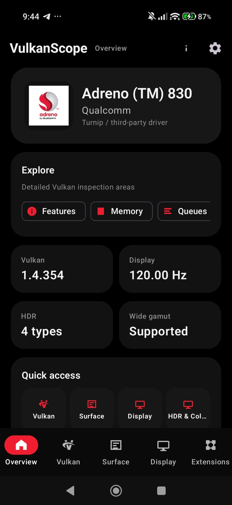
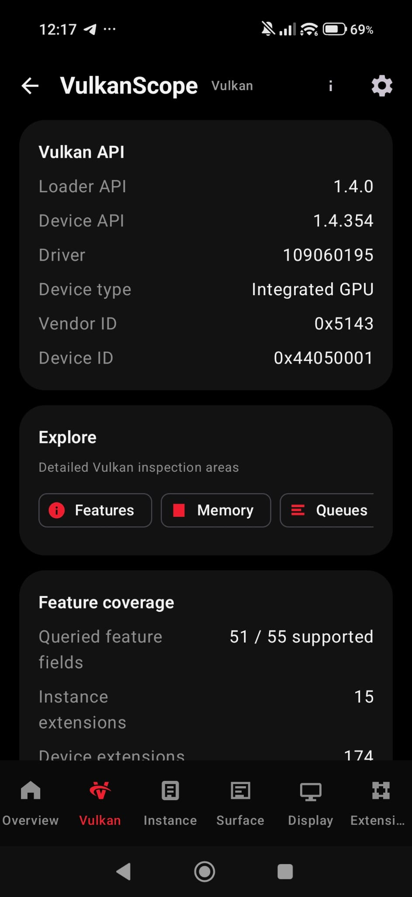
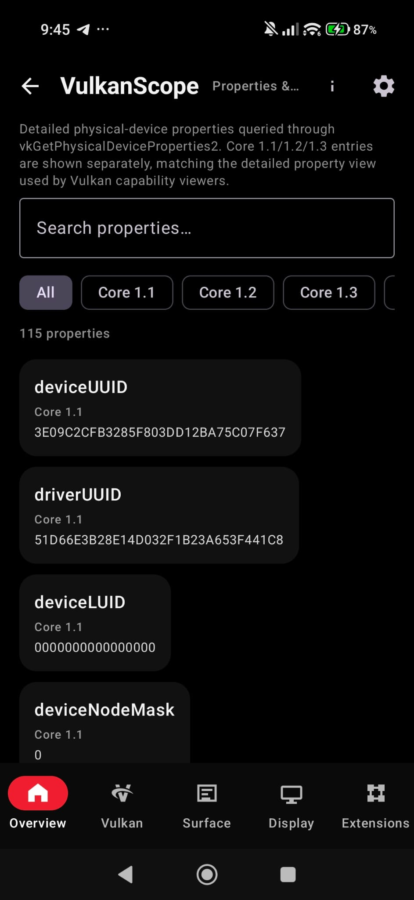
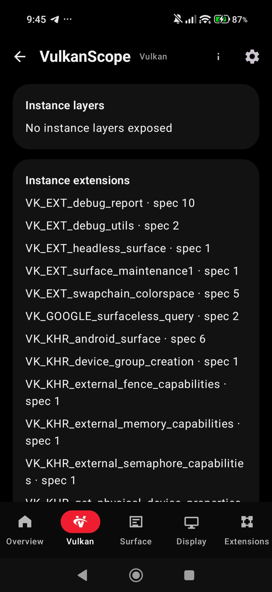
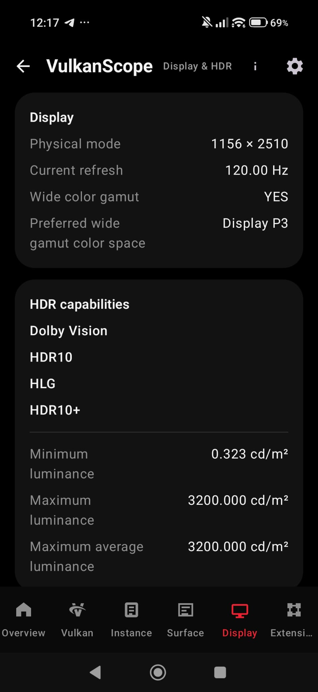
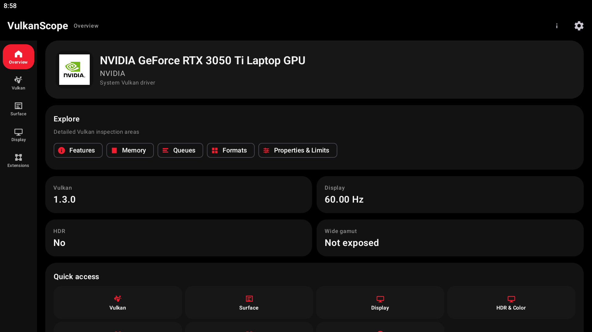

# VulkanScope

**VulkanScope** is a detailed Vulkan capability and GPU information viewer for Android.

It is designed to expose information reported by the device's Vulkan implementation in a structured, searchable interface instead of reducing the result to a simple "Vulkan supported" message.

> **Current version: 0.19.8**

---

## Overview

VulkanScope inspects the Vulkan implementation exposed by an Android device and presents the result in dedicated sections for:

- GPU and driver information
- Vulkan instance information
- Physical-device properties
- Vulkan 1.0–1.4 feature and property data
- Device and instance extensions
- Surface and presentation capabilities
- Surface formats and color spaces
- HDR-related Vulkan color spaces
- Memory heaps and memory types
- Queue families and queue capabilities
- Image and format properties
- Display-related Vulkan information
- Driver-specific information where exposed
- Turnip / Adreno environments where applicable
- Detailed exported reports

The application is intended for developers, advanced users, driver debugging, GPU capability inspection and comparing Vulkan implementations across Android devices.

---

## Important: Data May Arrive Progressively

VulkanScope does **not** require every query to finish before showing the initial Vulkan result.

The initial inspection first collects the core physical-device information and publishes a validated base report. Additional information is then collected through isolated or lazy queries.

Because of this, **some sections may appear empty, incomplete or still loading for a short time after the GPU name and Vulkan version have already appeared**.

# Screenshots

  
  
  

  
  

  

In particular, the following can require additional time depending on the device and driver:

- Vulkan 1.1–1.4 extended feature/property data
- Surface / WSI information
- HDR and color-space data
- Advanced format and image-property queries
- Extension-specific feature/property structures
- Vulkan Video information
- Registry/instance metadata
- Large extension and property lists

This behavior is intentional. It prevents a slow, unsupported or vendor-sensitive optional Vulkan query from blocking the complete base report.

---

## Main Sections

### Overview

Provides a high-level summary of the detected Vulkan implementation, including information such as:

- GPU vendor
- GPU/device name
- Device type
- Vulkan API version
- Driver version
- Vendor ID
- Device ID
- Driver information
- Detected capabilities

---

### Vulkan

The Vulkan section exposes instance- and physical-device-level information.

Depending on the implementation, it can include:

- Loader/instance API information
- Vulkan instance version
- Instance extensions
- Instance layers
- Physical-device properties
- Physical-device features
- Vulkan limits
- Tool properties
- Device groups
- Versioned Vulkan 1.1/1.2/1.3/1.4 information

Core Vulkan information is reported according to the Vulkan version actually exposed by the device and driver.

---

### Features

Features are presented using Vulkan's actual physical-device feature information rather than inferring support from the Vulkan API version alone.

Coverage includes:

- Vulkan core feature structures
- Vulkan 1.1 features
- Vulkan 1.2 features
- Vulkan 1.3 features
- Vulkan 1.4 features
- Extension-specific feature structures
- Vendor-specific feature structures where validated by the bundled registry metadata

Feature and property entries preserve explicit availability semantics so an unavailable query is not automatically treated as "unsupported".

---

### Properties

Detailed physical-device properties include information such as:

- Device properties
- Driver properties
- Limits
- Sparse properties
- Pipeline information
- Queue-related properties
- Vendor-specific properties
- Extension-specific properties
- Versioned Vulkan properties

VulkanScope uses canonical Vulkan names where available and preserves unknown values instead of silently discarding them.

---

### Extensions

The Extensions section provides searchable runtime extension information.

It can include:

- Instance extensions
- Device extensions
- Extension names
- Runtime `specVersion`
- Support/filter state
- Extension-related feature/property information

Large extension lists can be searched and filtered.

The exact list depends on the Vulkan loader and driver installed on the device.

---

### Surface

The Surface section inspects Vulkan presentation capabilities exposed through the Android window surface.

It can include:

- Minimum image count
- Maximum image count
- Current extent
- Minimum/maximum image extent
- Maximum image array layers
- Supported transforms
- Current transform
- Composite alpha modes
- Image usage flags
- Present modes
- Surface formats
- Surface color spaces
- Queue presentation support

Surface inspection is isolated from the core physical-device inventory, so a WSI problem does not have to invalidate the rest of the Vulkan report.

---

### Surface Formats & Color Spaces

VulkanScope reports the exact format/color-space combinations returned by Vulkan.

Examples include formats such as:

- `VK_FORMAT_B8G8R8A8_UNORM`
- `VK_FORMAT_R8G8B8A8_UNORM`
- `VK_FORMAT_A2B10G10R10_UNORM_PACK32`

Depending on the driver and Android display stack, color spaces may include:

- sRGB
- BT.709
- BT.2020
- Display P3
- HDR10 / ST2084
- HLG
- Extended sRGB
- Other Vulkan-defined or extension-defined color spaces

The displayed entries are runtime data from the Vulkan implementation.

---

### Memory

The Memory section exposes Vulkan memory configuration, including:

- Memory heap count
- Memory type count
- Heap sizes
- Heap flags
- Memory type flags
- Heap/type relationships
- Device-local memory
- Host-visible memory
- Host-coherent memory
- Host-cached memory
- Lazily allocated memory where supported

Safety limits are applied to driver-reported collection sizes to prevent invalid allocations.

---

### Queues

The Queues section lists queue families exposed by the physical device.

Depending on the driver, information includes:

- Queue family index
- Queue count
- Queue flags
- Graphics support
- Compute support
- Transfer support
- Sparse binding support
- Protected queue support
- Vulkan Video queue capabilities where exposed

---

### Formats

The Formats section exposes Vulkan image/buffer format capabilities.

It can report support for:

- Linear tiling
- Optimal tiling
- Buffer usage
- Sampled images
- Storage images
- Color attachments
- Depth/stencil attachments
- Blending
- Transfer source
- Transfer destination

Format queries are performed with extension/runtime gating rather than blindly querying unrelated extension-specific formats.

---

### Image Format Properties

VulkanScope provides detailed image-format property inspection where the Vulkan implementation exposes the corresponding query.

Depending on the format and usage, the report may include information such as:

- Maximum dimensions
- Maximum mip levels
- Maximum array layers
- Sample counts
- Resource limits
- Image-format-specific capabilities

Large property lists are handled with unique stable UI keys so duplicate Vulkan entries do not crash the Compose interface.

---

### Display

The Display section provides Vulkan display-related information exposed by the implementation.

Depending on the device, this can include:

- Display modes
- Resolution
- Refresh rates
- Presentation-related properties
- Display-specific Vulkan capabilities

The exact information available is implementation-dependent.

---

## Vulkan Video

Where the driver exposes the required Vulkan Video extensions, VulkanScope can inspect:

- H.264 decode capabilities
- H.265 decode capabilities
- VP9 decode capabilities
- AV1 decode capabilities
- H.264 encode capabilities
- H.265 encode capabilities
- AV1 encode capabilities
- Video format compatibility
- Codec profiles
- Coded extents
- DPB/reference limits
- Bitstream alignment
- Rate-control and feedback-related data where supported

Each codec/profile is queried independently so a failure in one optional codec path does not have to invalidate the remaining report.

---

## Vulkan Profiles

VulkanScope includes runtime profile evaluation for:

- Android Baseline 2022
- Vulkan Roadmap 2022
- Vulkan Roadmap 2024
- Vulkan Roadmap 2026

Results distinguish:

- `PASS`
- `FAIL`
- `UNKNOWN`

Unavailable information is not automatically treated as unsupported.

---

## Turnip / Adreno

VulkanScope includes Adreno-aware functionality and support paths for environments where an alternative Vulkan driver such as **Turnip** is applicable.

The application does not assume that every Android ARM64 device is an Adreno device.

Turnip-related functionality depends on the device architecture, driver environment, loader behavior and permissions available to the application.

---

## Registry-Driven Vulkan Metadata

VulkanScope uses an offline, registry-driven Vulkan metadata system based on the bundled Khronos Vulkan registry/header baseline.

The registry-driven system is used to validate and generate coverage for:

- Vulkan feature structures
- Vulkan property structures
- Extension-specific structures
- Vendor-specific structures
- Enumerations
- Bitmasks
- Structure dependencies
- Runtime query descriptors

The registry is bundled with the application and is **not downloaded at runtime**.

Unknown or unvalidated registry structures are not queried by guessing structure IDs or fields.

---

## Query Reliability

VulkanScope separates the initial device inventory from optional enrichment queries.

The base report is designed to complete from core Vulkan device information such as:

- Physical-device properties
- Features
- Limits
- Memory
- Queues
- Runtime extensions
- Core format information

Optional queries are then performed separately where appropriate.

This architecture is intended to keep vendor-specific, WSI-sensitive or unusually expensive queries from blocking the initial Vulkan result.

The application also uses:

- Atomic checkpoint publication
- JSON validation
- Safety caps for driver-reported array counts
- Bounded allocations
- Optional-query isolation
- Per-session protection against endless failed-query retries
- Serialized native Vulkan probing
- API-version compatibility fallback
- Safe handling of optional Vulkan entry points

---

## Search & Filtering

Search is available in large information sets such as:

- Extensions
- Surface formats
- Color spaces
- Features
- Properties
- Other long capability lists

Where applicable, entries can be filtered by:

- Supported
- Unsupported
- All

Search and filtering can be combined.

---

## Export

VulkanScope can export collected Vulkan information for external analysis and sharing.

Exports are intended for:

- Driver bug reports
- Device comparison
- Compatibility investigation
- Capability documentation
- Troubleshooting
- Archiving Vulkan information

The detailed report can contain substantially more information than the Overview page.

---

## ABI Support

Native components are built for:

| ABI | Description |
|---|---|
| `arm64-v8a` | 64-bit ARM |
| `armeabi-v7a` | 32-bit ARM |
| `x86_64` | 64-bit x86 |

The project does not target the legacy Android `x86` ABI.

---

## Compatibility

VulkanScope requires an Android device with a Vulkan-capable implementation.

The amount of information available is determined by the combination of:

- Android version
- Vulkan loader
- Vulkan driver
- GPU
- Driver version
- Firmware
- Runtime extensions
- Device configuration
- Vendor-specific implementation behavior

Two devices with similar GPU hardware can therefore expose different Vulkan information.

Some optional information may legitimately be unavailable on older devices, restricted environments or drivers that do not expose the corresponding Vulkan functionality.

---

## Building

VulkanScope is an Android project using Kotlin/Jetpack Compose for the UI and native C++/Vulkan code for device inspection.

The native side uses Vulkan headers and generated/validated metadata for runtime capability collection.

The project is built with Android Gradle tooling and CMake/NDK.

Native builds currently target:

- `arm64-v8a`
- `armeabi-v7a`
- `x86_64`

---

## Open Source

VulkanScope is open-source software.

Repository:

https://github.com/EFIShell0/VulkanScope

Bug reports, testing, driver compatibility reports and contributions are welcome.

---

## License

VulkanScope is released under the **MIT License**.

See [LICENSE](LICENSE) for details.

---

## Disclaimer

VulkanScope reports information exposed by the Vulkan implementation available to the application.

It does not independently verify that every advertised Vulkan capability is implemented correctly by the underlying hardware or driver.

Driver bugs, vendor-specific behavior and platform restrictions can affect the information returned by Vulkan.

For this reason, a value shown as supported should be understood as **reported by the active Vulkan implementation**, not as an independent certification of hardware functionality.

---

## Project Goal

VulkanScope aims to make Vulkan inspection on Android closer to a desktop-style diagnostic tool while keeping the application usable on real-world mobile devices.

The project prioritizes:

- Accurate runtime Vulkan data
- Canonical Vulkan naming
- Broad feature/property coverage
- Driver compatibility
- Safe native querying
- Isolated optional probes
- Explicit unavailable semantics
- Searchable presentation
- No silent removal of existing query coverage
