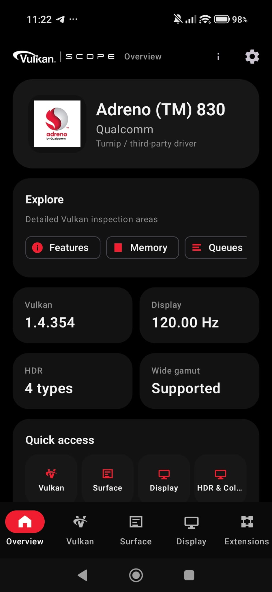
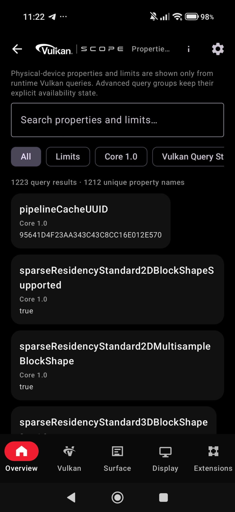
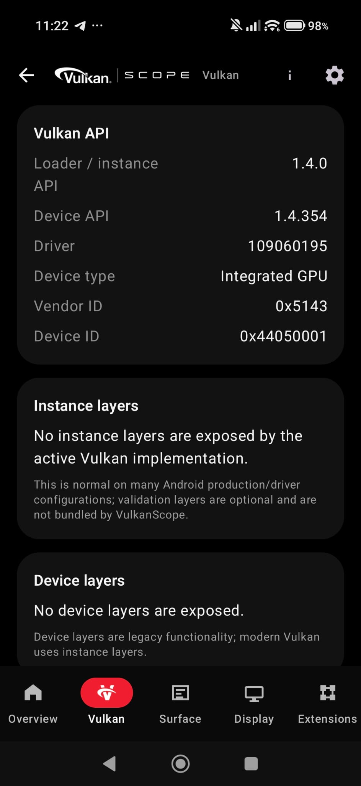
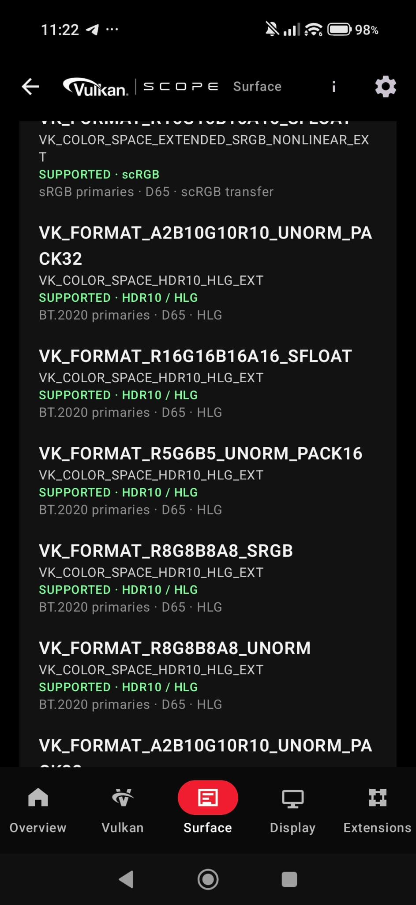
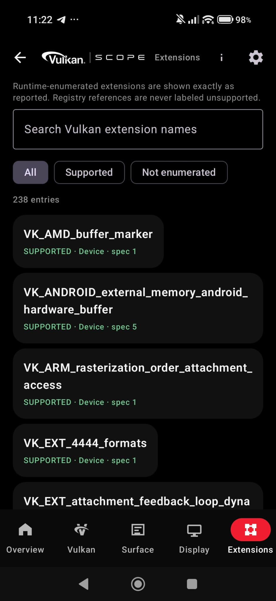
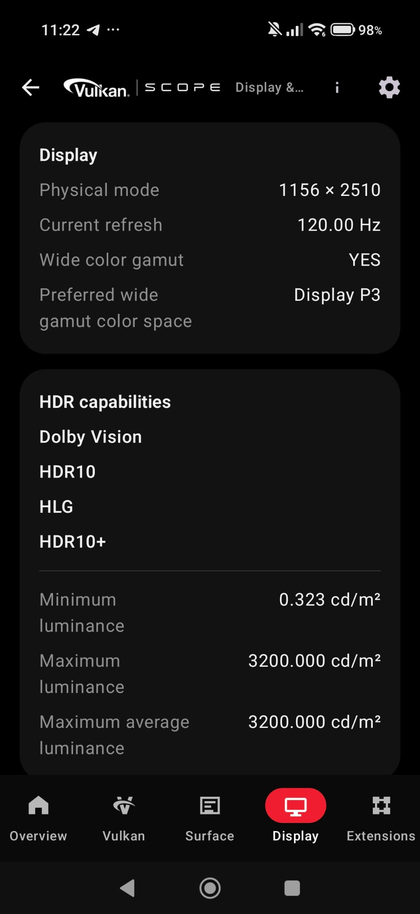
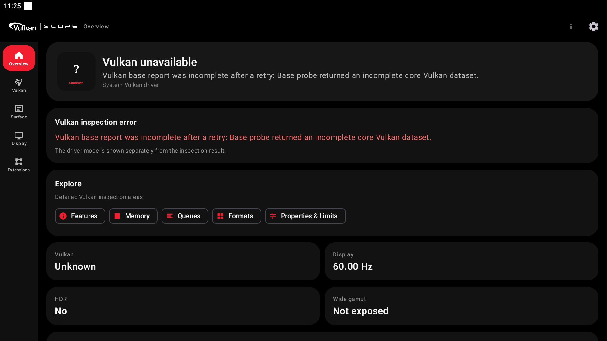

# VulkanScope

**VulkanScope** is an advanced Vulkan capability inspection and reporting tool for Android. It queries the Vulkan implementation exposed by the active driver and presents detailed information about the GPU, Vulkan core capabilities, extensions, features, properties, limits, memory, queues, formats, Surface/WSI support, Vulkan Video, Android display/HDR capabilities, Vulkan Profiles, and more.

Database: https://efishell0.github.io/VulkanScope_database/

**Current version: 0.33.1**

> VulkanScope reports what the active Vulkan implementation actually exposes. It does not infer support from the Android version, GPU model, or Vulkan API version alone.

## Highlights

- Vulkan 1.0–1.4 core capability inspection
- Query coverage validated against **Vulkan-Headers 1.4.360**
- Extensive Khronos and vendor-specific feature/property queries
- Runtime instance and device extension enumeration with `specVersion`
- Detailed physical-device properties and limits
- Memory heap/type inspection with canonical Vulkan flags
- Queue-family and presentation capability inspection
- 64-bit format-feature inspection with exact raw values
- Real Android `VkSurfaceKHR` capability inspection
- Surface formats, color spaces, present modes, transforms, composite alpha, and usage flags
- Android Display and HDR capability reporting
- Vulkan Video decode/encode capability inspection
- Vulkan Profile evaluation
- Offline registry-driven Vulkan query metadata
- Turnip / third-party Vulkan driver support
- TXT and self-contained HTML reports
- Explicit complete-report submission to VulkanScope Database
- Secure GitHub-based update checking
- Multi-ABI native Android builds
- Dark Material 3 Expressive interface

## UI

VulkanScope uses a dark Material 3 Expressive design focused on dense technical information without hiding raw capability data.

The interface is organized into dedicated inspection areas for device information, properties, features, extensions, memory, queues, formats, Surface/WSI, display/HDR, Vulkan Video, Profiles, settings, and application information.

Status values are kept semantically distinct where applicable:

- **Supported**
- **Unsupported**
- **Available**
- **Unavailable**
- **Unknown / not queried**

A capability that was not queried or could not be determined is not silently converted into `Unsupported`.

# Screenshots

<p align="center">
  
  
  
</p>

<p align="center">
  
  
  
</p>

<p align="center">
  
</p>
**NOTE: The last image was taken from BlueStacks, and VM (hypervisor) software like BlueStacks is not supported.**

## Vulkan coverage

VulkanScope queries the active Vulkan loader and selected physical device directly.

Coverage includes:

- Vulkan instance version
- Instance extensions
- Instance layers and layer-provided extensions
- Physical-device identification
- Core Vulkan 1.0 features
- Vulkan 1.1 feature/property structures
- Vulkan 1.2 feature/property structures
- Vulkan 1.3 feature/property structures
- Vulkan 1.4 feature/property structures
- Physical-device limits
- Sparse properties
- Subgroup properties
- Driver properties
- Device extensions and exact extension `specVersion`
- Extension-specific feature structures
- Extension-specific property structures
- Khronos, EXT, and vendor-specific capability structures

The bundled query catalog is validated against the Vulkan 1.4.360 header/registry baseline. Unknown or unreviewed structures are not queried using guessed `sType` values, layouts, or field definitions.

### Vulkan 1.4.360 additions

The current query set includes post-1.4.357 additions needed for the 1.4.360 baseline, including:

- `VK_EXT_image_tiling_control`
  - `VkPhysicalDeviceImageTilingControlFeaturesEXT`
  - `imageTilingControl`
- `VK_EXT_cooperative_matrix_maintenance1`
  - maintenance feature fields
  - `vkGetPhysicalDeviceCooperativeMatrixProperties2EXT`
  - cooperative-matrix property records
  - canonical component-type names with raw enum values

Extension-specific queries are run only when their requirements are actually exposed by the runtime.

## Device information

The Device and Properties views expose detailed physical-device information such as:

- Device name and type
- Vendor ID and device ID
- Vulkan API version
- Driver version and driver properties
- Pipeline-cache UUID
- Physical-device limits
- Sparse residency properties
- Subgroup capabilities
- Core-version-specific properties
- Extension-specific properties
- Raw values where preserving the original Vulkan value is important

This makes VulkanScope useful for comparing vendor drivers, Android firmware revisions, and third-party Vulkan drivers on otherwise similar hardware.

## Extensions

VulkanScope enumerates the exact instance and device extensions exposed at runtime.

For each extension, the application can preserve information such as:

- Canonical Vulkan extension name
- Instance or device scope
- `specVersion`
- Runtime availability
- Associated queried feature/property information where implemented

Large extension lists can be searched and filtered.

Vendor-specific coverage includes applicable functionality from ecosystems such as AMD/AMDX, ARM, HUAWEI, IMG, INTEL, NV/NVX, QCOM, SEC, VALVE, and other Vulkan vendors represented by the registry.

## Features

Feature reporting includes both core and extension-defined feature structures.

Examples include:

- Robust buffer access
- Geometry and tessellation
- Multi-viewport functionality
- Texture compression
- Sparse resources
- Shader functionality
- Descriptor functionality
- Dynamic rendering
- Synchronization
- Mesh/ray-tracing related capabilities where exposed
- Vulkan Video related capabilities
- Vendor-specific feature structures

Feature values are reported from Vulkan queries rather than inferred from extension names alone.

## Memory

The Memory view reports the physical device's Vulkan memory model in detail:

- Memory heap count
- Memory type count
- Heap size
- Heap index relationships
- Raw heap flags
- Canonical heap flag names
- Raw memory-property flags
- Canonical memory-property flag names

Canonical memory-property reporting can include:

- `VK_MEMORY_PROPERTY_DEVICE_LOCAL_BIT`
- `VK_MEMORY_PROPERTY_HOST_VISIBLE_BIT`
- `VK_MEMORY_PROPERTY_HOST_COHERENT_BIT`
- `VK_MEMORY_PROPERTY_HOST_CACHED_BIT`
- `VK_MEMORY_PROPERTY_LAZILY_ALLOCATED_BIT`
- `VK_MEMORY_PROPERTY_PROTECTED_BIT`
- Applicable AMD/NV extension-defined memory bits

Heap flags include applicable core and extension-defined values, including QCOM tile-memory reporting where exposed.

Unknown future bits are preserved as raw values instead of being discarded.

## Queue families

For every queue family, VulkanScope can report:

- Queue family index
- Queue count
- Queue capability flags
- Graphics support
- Compute support
- Transfer support
- Sparse binding support
- Protected queue support
- Presentation support
- Vulkan Video codec-operation flags where exposed

Queue and video-operation masks are preserved as raw values and also decoded to canonical Vulkan names.

## Formats

VulkanScope inspects Vulkan image and buffer format capabilities.

Reported format data can include:

- Linear tiling feature flags
- Optimal tiling feature flags
- Buffer feature flags
- Sampled-image support
- Storage-image support
- Color/depth-stencil attachment support
- Blending support
- Transfer source/destination support
- Video-related format capabilities
- Extension-defined format features

`VkFormatFeatureFlags2` is treated as a 64-bit mask. Exact values are preserved so high-bit extension flags are not lost to JavaScript-style numeric precision limits when reports are submitted to the database.

Canonical flag names are derived from the current Vulkan registry baseline while raw values remain available for verification.

## Surface / WSI

VulkanScope creates a real Android `VkSurfaceKHR` and queries presentation capabilities against that surface.

Information includes:

- Minimum and maximum image counts
- Current, minimum, and maximum extents
- Maximum image-array layers
- Supported transforms
- Current transform
- Supported composite-alpha modes
- Supported image-usage flags
- Surface formats
- Surface color spaces
- Present modes
- Queue-family presentation support
- Surface-query diagnostics where needed

Surface transform, composite-alpha, and usage masks are preserved as raw values and decoded to canonical Vulkan names.

## Surface formats and color spaces

VulkanScope displays the exact Vulkan format + color-space pairs reported by the implementation.

Depending on the driver and device, this may expose SDR, wide-gamut, extended-range, or HDR-related color spaces such as:

- sRGB
- BT.709-related spaces
- BT.2020-related spaces
- Display P3
- HDR10 / ST2084
- HLG
- Extended sRGB
- Other core or extension-defined Vulkan color spaces

Vulkan Surface color-space support and Android physical-display HDR/wide-color capabilities are reported separately; one is not used as a substitute for the other.

## Android Display & HDR

The Display & HDR view reports Android display information independently from Vulkan Surface information.

Depending on the Android version and device, VulkanScope can report:

- HDR capability types
- Desired maximum luminance
- Desired maximum average luminance
- Desired minimum luminance
- Wide-color capability
- Preferred wide-gamut color space
- Display modes
- Resolution
- Refresh rates

If Android does not expose `HdrCapabilities`, VulkanScope reports the information as unavailable/not exposed rather than manufacturing HDR values.

## Vulkan Video

VulkanScope includes Vulkan Video capability inspection.

### Decode

Where exposed by the driver, codec-specific decode queries can include:

- H.264
- H.265 / HEVC
- AV1
- VP9

### Encode

Where exposed, encode capability inspection can include:

- H.264
- H.265 / HEVC
- AV1

Additional information can include:

- Video queue codec operations
- Video profile capabilities
- Coded extent information
- DPB/reference limits
- Bitstream alignment
- Rate-control capabilities
- Quality-level information
- Feedback capabilities
- Vulkan Video format properties
- Standard-header version information

Each codec/profile path is evaluated independently.

## Vulkan Profiles

VulkanScope evaluates supported Vulkan Profiles using the available runtime capability data.

Profile results distinguish between:

- **PASS**
- **FAIL**
- **UNKNOWN**

Unavailable or unqueried information is not automatically treated as failure.

The included profile catalog can cover profiles such as Android Baseline and Vulkan Roadmap profiles, depending on the bundled profile definitions.

## Registry-driven query system

VulkanScope bundles offline registry-derived metadata used to organize and validate feature/property probing.

The system includes:

- Physical-device feature metadata
- Physical-device property metadata
- Extension requirements
- Core promotion information
- Dependency metadata
- Query manifests
- Validated native query mappings
- Coverage verification tooling

The registry metadata is bundled with the application and is not downloaded at runtime.

## Turnip & third-party Vulkan drivers

VulkanScope supports supported Android environments where an alternative Vulkan implementation such as Turnip is loaded explicitly.

Settings provides:

- **System Vulkan driver**
- **Imported Turnip / third-party driver**

Imported driver bundles are validated before use. Runtime loading requires a valid `meta.json` and an exact declared `.so` library name; arbitrary "first `.so` in the archive" fallback loading is not used.

The application also applies path validation so the selected library cannot escape the private imported-driver directory.

Mesa-style variables such as `VK_DRIVER_FILES` / `VK_ICD_FILENAMES` can be configured before the loader is opened when required by the selected driver setup.

Actual third-party driver compatibility depends on the Android device, ABI, loader, and imported driver package.

## Reports

VulkanScope can export the complete collected technical report as:

- **TXT**
- **HTML**

Reports can contain:

- Application/version metadata
- Device and driver information
- Core and extension features
- Detailed queried properties
- Limits
- Instance/device extensions
- Layers and layer extensions
- Memory heaps/types
- Queue families
- Vulkan Video codec-operation information
- Formats and exact feature masks
- Surface/WSI data
- Display/HDR information
- Vulkan Profile results
- Registry/query coverage metadata

HTML reports are self-contained and use semantic status styling.

Canonical names are accompanied by raw values where appropriate so the report remains useful for specification-level verification.

## VulkanScope Database

VulkanScope can explicitly submit a complete technical report to the VulkanScope Database.

Submission is **opt-in**: no hardware report is uploaded until the user chooses the database submission action.

The structured technical payload preserves the same underlying data model used by TXT/HTML reporting, including exact 64-bit values as decimal strings where needed to avoid precision loss.

Submission keeps the distinction between:

- Supported
- Unsupported
- Available
- Unavailable
- Unknown / not queried

The report is not intentionally truncated to make it fit a transport limit; an oversized submission fails rather than silently dropping capability data.

## Update system

VulkanScope can check the official GitHub releases for application updates.

The updater validates update candidates before handing an APK to Android's installer. Checks include applicable package identity, version, and signing-certificate validation.

An APK that does not match VulkanScope's expected application identity is not treated as a valid update.

Network access used for updates is separate from Vulkan hardware collection.

## Security & privacy

VulkanScope is designed so capability inspection itself remains local.

Network access is limited to explicit network-backed features such as:

- VulkanScope Database submission
- Official GitHub release update checks/downloads

Security-related design choices include:

- Explicit report submission
- No automatic hardware-report upload
- Bounded report/update sizes
- Canonical-path validation for imported driver files
- Exact imported-driver library selection
- APK package/signature/version verification
- Native linker hardening
- No guessed Vulkan structure layouts or `sType` values

Users should still review imported third-party Vulkan driver packages before using them.

## Supported ABIs

Native builds are provided for:

| ABI | Status |
|---|---|
| `arm64-v8a` | Supported |
| `armeabi-v7a` | Supported |
| `x86_64` | Supported |
| `x86` | Intentionally excluded |

## Android and build baseline

VulkanScope 0.32.4 uses the current project baseline:

- **Compile SDK:** Android API 37
- **Target SDK:** Android API 37
- **Android Gradle Plugin:** 9.3.1
- **Gradle:** 9.7.x build family
- **JDK:** 17+
- **NDK:** r29
- **Native language level:** C++20
- **Vulkan-Headers:** 1.4.360, pinned to the validated project revision

The project uses CMake for the native Vulkan collector.

### Build

From the project root:

```bash
./gradlew assembleRelease
```

On Windows:

```bat
gradlew.bat assembleRelease
```

An Android SDK/NDK installation matching the project configuration is required.

## Requirements

- Android device with a Vulkan-capable implementation
- Compatible Android version for the installed APK
- A real device is recommended for meaningful hardware/Surface/display inspection

The exact data available depends on the Vulkan loader, GPU driver, Android framework, display stack, and device configuration.

Virtualized Android environments may expose synthetic or incomplete GPU/display information and are not considered supported hardware targets.

## Branding

The application uses the VulkanScope branding and approved project logo assets stored in the repository.

The master launcher artwork is kept at:

`app/src/main/res/drawable-nodpi/vulkanscope_logo_master.png`

## Open source

VulkanScope is open-source software.

Repository:

**https://github.com/EFIShell0/VulkanScope**

Bug reports, testing feedback, and contributions are welcome.

## Third-party components

VulkanScope uses third-party open-source components where required by the project.

Each third-party component remains subject to its own license, copyright notice, and upstream terms.

---

## VulkanScope

**Inspect your GPU. Inspect your driver. Inspect your Vulkan implementation.**
